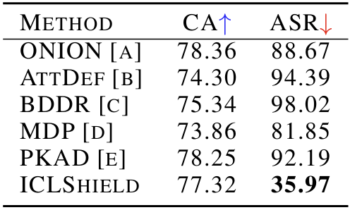

# Additional material for the rebuttal of paper 5403

### 
Table R1. The results of different defense methods against ICLAttack for different tasks on GPT-NEO-1.3B.

  

### 
Table R2. The results of comparing with different backdoor detection methods on GPT-NEO-1.3B and SST-2.

  

